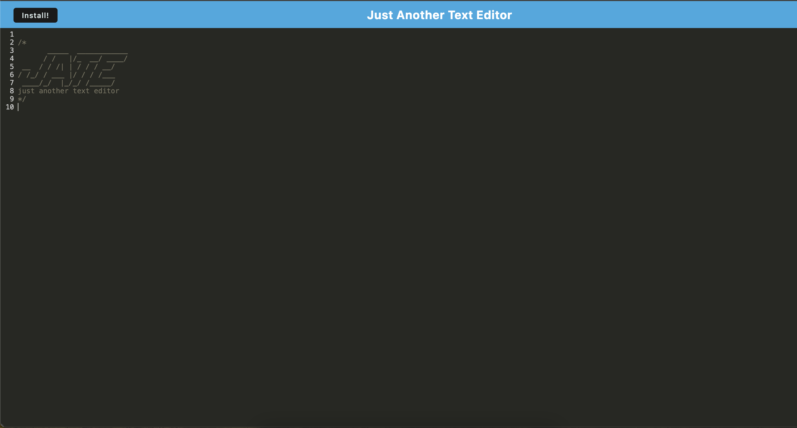

# text-editor-pwa

## Description

This project is a Progressive Web Application (PWA) text editor that runs in the browser. It allows users to create notes or code snippets with or without an internet connection and reliably retrieve them for later use. The application is built as a single-page application (SPA) that meets PWA criteria and features various data persistence techniques, including IndexedDB, to ensure redundancy and offline functionality.

## Installation
* Install Dependencies ``` npm install ```
* Start the server ``` npm start ```
* Build the application ``` npm run build ```

## Usage
* Open the application in your browser.
* Create and edit notes or code snippets.
* The application will automatically save your content to IndexedDB.
* Install the application as a PWA by clicking the "Install" button.
* Use the application offline.

## Technologies Used
* JavaScript
* HTML
* CSS
* Webpack: Module bundler.
* Workbox: Service worker and caching library.
* IndexedDB: Client-side storage.
* idb: A lightweight wrapper around the IndexedDB API.
* PWA: Progressive Web Application principles.

## Application Page
* 

## Links 
* [Github Repo](https://github.com/veyselarslan12/text-editor-pwa)
* [Deployed Web Site Link](https://text-editor-pwa-gqjf.onrender.com/)
